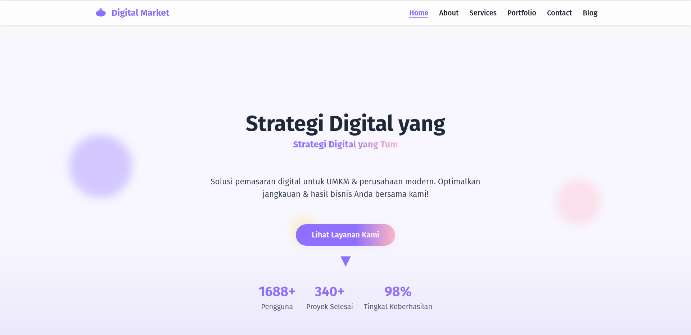
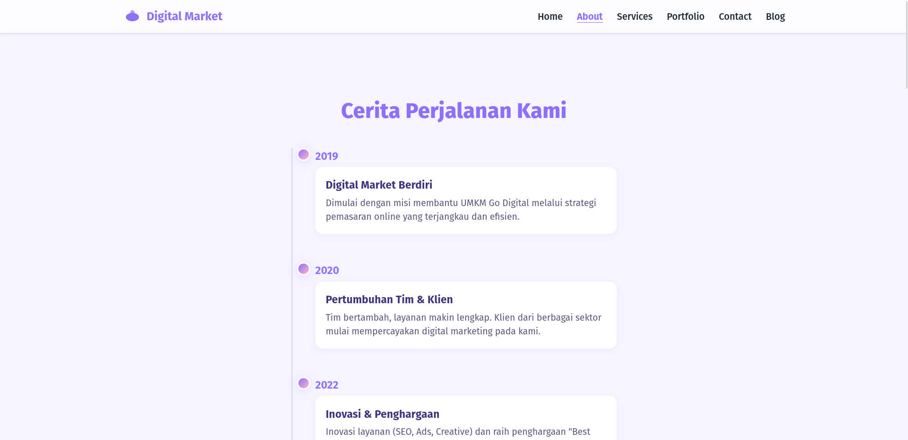
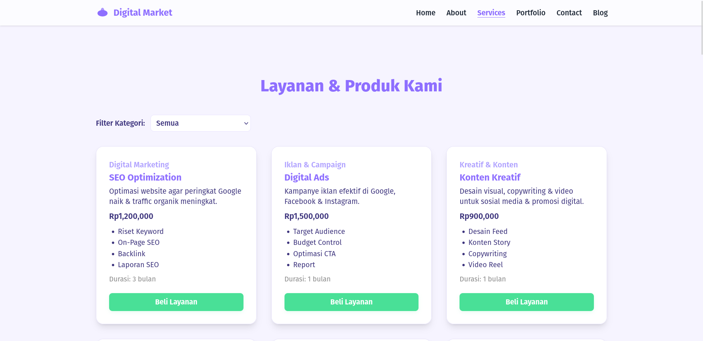
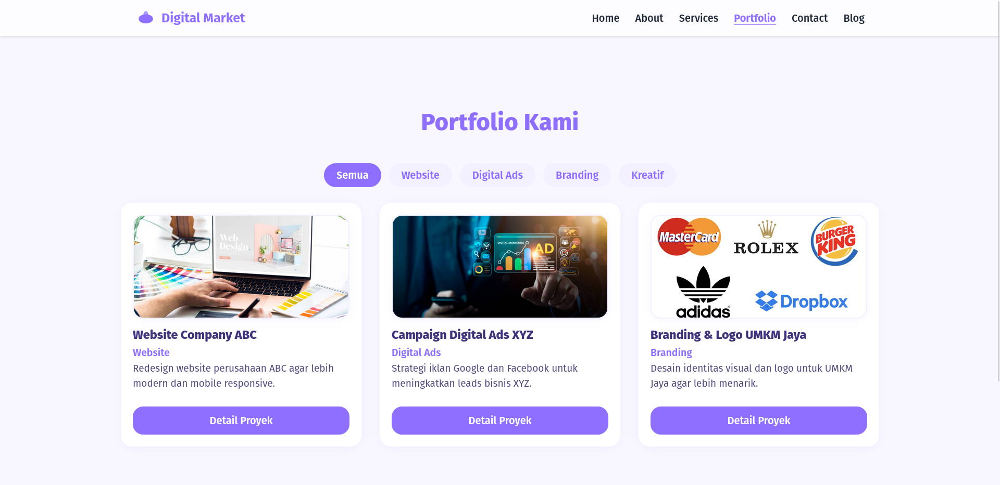
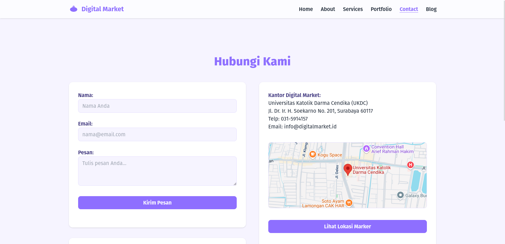
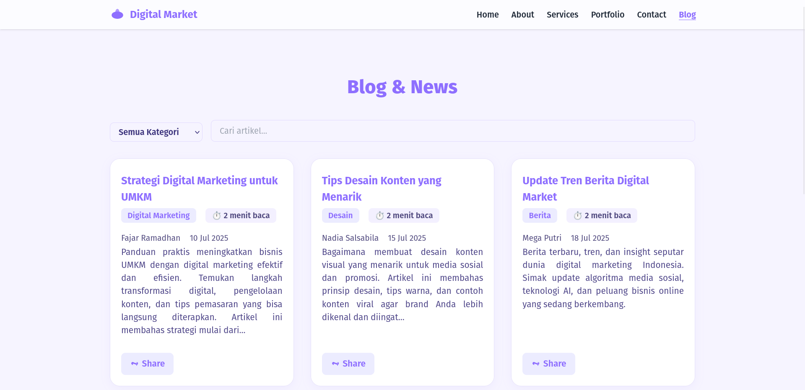

# Digital Market - Final PPPL Website

Website multi-halaman untuk Digital Marketing Agency.  
Dikembangkan sebagai tugas akhir PPPL, menampilkan fitur interaktif, animasi, dan struktur modular dengan HTML, CSS, dan JavaScript.

---

## Daftar Isi

- [Deskripsi Proyek](#deskripsi-proyek)
- [Fitur Utama](#fitur-utama)
- [Struktur Halaman](#struktur-halaman)
- [Struktur Folder & File](#struktur-folder--file)
- [Cara Menjalankan](#cara-menjalankan)
- [Preview & Demo](#preview--demo)

---

## Deskripsi Proyek

Website agency pemasaran digital dengan tujuan:

- Menampilkan layanan, portfolio, dan profil perusahaan.
- Memudahkan klien untuk memahami produk, menghubungi, dan konsultasi.
- Menerapkan prinsip pengembangan perangkat lunak modern dan design pattern.

---

## Fitur Utama

- **Homepage:** Hero animated parallax, typing effect, statistic counter, CTA smooth scroll.
- **Features/Services:** Card hover, animated icons, progressive disclosure, detail layanan.
- **Testimonials:** Carousel, star rating interaktif, dynamic content.
- **About:** Timeline animasi, team card flip, animated counter, value perusahaan interaktif.
- **Services:** Catalog filter, price calculator, paket comparison, custom form.
- **Portfolio:** Filter grid, lightbox gallery, modal detail, client testimonial per project.
- **Contact:** Validasi form real-time, Google Maps embed, marker interaktif, live chat simulasi, FAQ accordion & search.
- **Blog (Opsional):** Article list, paginasi, kategori, pencarian, kalkulator waktu baca, tombol share.

---

## Struktur Halaman

- `/html/index.html` - Homepage
- `/html/about.html` - Tentang Perusahaan
- `/html/services.html` - Layanan
- `/html/portfolio.html` - Portfolio & Studi Kasus
- `/html/contact.html` - Kontak & FAQ
- `/html/blog.html` - Blog/News (opsional)

---

## Struktur Folder & File

```
final-pppl/
├── html/
│   ├── index.html
│   ├── about.html
│   ├── services.html
│   ├── portfolio.html
│   ├── contact.html
│   └── blog.html
├── css/
│   ├── index-style.css
│   ├── about-style.css
│   ├── services-style.css
│   ├── portfolio-style.css
│   ├── contact-style.css
│   └── blog-style.css
├── js/
│   ├── script.js
│   ├── about-script.js
│   ├── services-script.js
│   ├── portfolio-script.js
│   ├── contact-script.js
│   └── blog-script.js
├── favicon.svg
└── README.md
```

---

## Cara Menjalankan

1. Clone/download repo ini.
2. Buka `/html/index.html` di browser.
3. Navigasikan halaman via menu/navbar.
4. Semua fitur interaktif berjalan di browser (no backend).

---

## Preview & Demo

Berikut beberapa tampilan halaman website:

- **Homepage**
  

- **About Page**
  

- **Services Page**
  

- **Portfolio Page**
  

- **Contact Page**
  

- **Blog Page (Opsional)**
  

---
